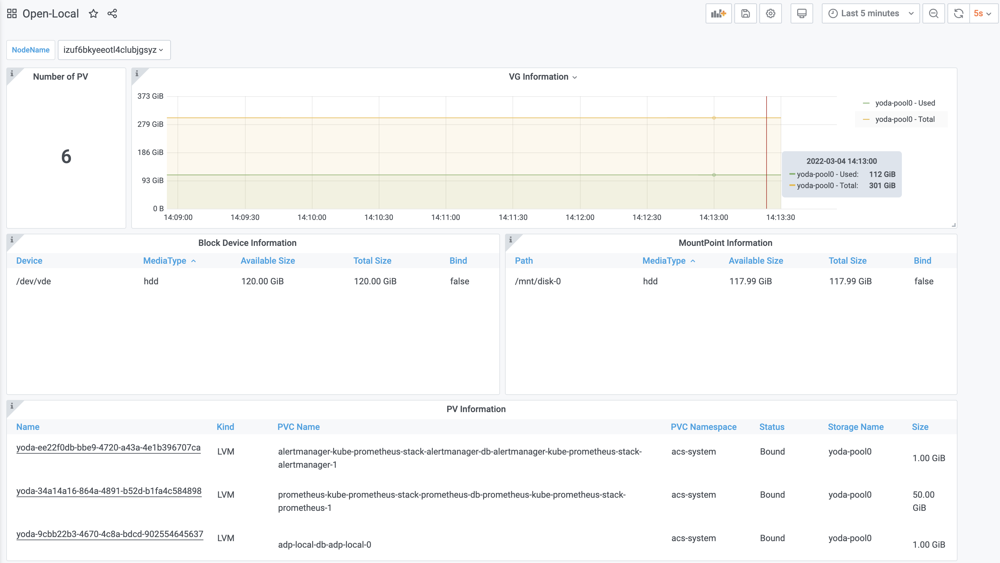

# Open-Local

[](https://goreportcard.com/report/github.com/alibaba/open-local)

[](https://codecov.io/gh/alibaba/open-local)

English | [简体中文](./README_zh_CN.md)

`Open-Local` is a **local disk management system** composed of multiple components. With `Open-Local`, **using local storage in Kubernetes will be as simple as centralized storage**.

## Features

- Local storage pool management
- Dynamic volume provisioning
- Extended scheduler
- Volume expansion
- Volume snapshot
- Volume metrics
- Raw block volume
- IO Throttling(direct-io only)
- Ephemeral inline volume

## Open-Local Feature Matrix

| Feature                             | Open-Local Version | K8S Version |
| ----------------------------------- | ------------------ | ----------- |
| Node Disk pooling                   | v0.1.0+            | 1.18-1.20   |
| Dynamic Provisioning                | v0.1.0+            | 1.20-1.22   |
| Volume Expansion                    | v0.1.0+            | 1.20-1.22   |
| Volume Snapshot                     | v0.1.0+            | 1.20-1.22   |
| LVM/Block Device/Mountpoints as fs  | v0.1.0+            | 1.18-1.20   |
| Raw Block Device(volumeMode: Block) | v0.3.0+            | 1.20-1.22   |
| IO-Throttling                       | v0.4.0+            | 1.20-1.22   |
| CSI ephemeral volumes               | v0.5.0+            | 1.20-1.22   |
| IPv6 Support                        | v0.5.3+            | 1.20-1.22   |
| SPDK host device                    | v0.6.0+            | 1.20-1.22   |
| Read-write snapshot                 | v0.7.0+            | 1.20-1.22   |

## Overall Architecture

```
┌─────────────────────────────────────────────────────────────────────────────┐
│ Master                                                                      │
│                   ┌───┬───┐           ┌────────────────┐                    │
│                   │Pod│PVC│           │   API-Server   │                    │
│                   └───┴┬──┘           └────────────────┘                    │
│                        │ bound                ▲                             │
│                        ▼                      │ watch                       │
│                      ┌────┐           ┌───────┴────────┐                    │
│                      │ PV │           │ Kube-Scheduler │                    │
│                      └────┘         ┌─┴────────────────┴─┐                  │
│                        ▲            │     open-local     │                  │
│                        │            │ scheduler-extender │                  │
│                        │      ┌────►└────────────────────┘◄───┐             │
│ ┌──────────────────┐   │      │               ▲               │             │
│ │ NodeLocalStorage │   │create│               │               │  callback   │
│ │    InitConfig    │  ┌┴──────┴─────┐  ┌──────┴───────┐  ┌────┴────────┐    │
│ └──────────────────┘  │  External   │  │   External   │  │  External   │    │
│          ▲            │ Provisioner │  │   Resizer    │  │ Snapshotter │    │
│          │ watch      ├─────────────┤  ├──────────────┤  ├─────────────┤    │
│    ┌─────┴──────┐     ├─────────────┴──┴──────────────┴──┴─────────────┤GRPC│
│    │ open-local │     │                 open-local                     │    │
│    │ controller │     │             CSI ControllerServer               │    │
│    └─────┬──────┘     └────────────────────────────────────────────────┘    │
│          │ create                                                           │
└──────────┼──────────────────────────────────────────────────────────────────┘
           │
┌──────────┼──────────────────────────────────────────────────────────────────┐
│ Worker   │                                                                  │
│          │                                                                  │
│          ▼                ┌───────────┐                                     │
│ ┌──────────────────┐      │  Kubelet  │                                     │
│ │ NodeLocalStorage │      └─────┬─────┘                                     │
│ └──────────────────┘            │ GRPC                     Shared Disks     │
│          ▲                      ▼                          ┌───┐  ┌───┐     │
│          │              ┌────────────────┐                 │sdb│  │sdc│     │
│          │              │   open-local   │ create volume   └───┘  └───┘     │
│          │              │ CSI NodeServer ├───────────────► VolumeGroup      │
│          │              └────────────────┘                                  │
│          │                                                                  │
│          │                                                 Exclusive Disks  │
│          │                ┌─────────────┐                  ┌───┐            │
│          │ update         │ open-local  │  init device     │sdd│            │
│          └────────────────┤    agent    ├────────────────► └───┘            │
│                           └─────────────┘                  Block Device     │
│                                                                             │
│                                                                             │
└─────────────────────────────────────────────────────────────────────────────┘
```

`Open-Local`contains four types of components:

- Scheduler extender: as an extended component of Kubernetes Scheduler, adding local storage scheduling algorithm
- CSI plugins: providing the ability to create/delete volume, expand volume and take snapshots of the volume
- Agent: running on each node in the K8s cluster, initializing the storage device according to the configuration list, and reporting local storage device information for Scheduler extender
- Controller: getting the cluster initial configuration of the storage and deliver a detailed configuration list to Agents running on each node

`Open-Local` also includes a monitoring dashboard:



## Who uses Open-Local

`Open-Local` has been widely used in production environments, and currently used products include:

- [ACK Distro](https://github.com/AliyunContainerService/ackdistro)
- Alibaba Cloud ECP (Enterprise Container Platform)
- Alibaba Cloud ADP (Cloud-Native Application Delivery Platform)
- [CNStack Products](https://github.com/alibaba/CNStackCommunityEdition)
- AntStack Plus Products

## User guide

More details [here](docs/user-guide/user-guide.md)

## Collecting User Cases
Before adopting open-local in production, k8s users usually want to know use cases for open-local.
Please send us PR to update [Use Cases](docs/use-cases.md) with `company`, `use case` and `since` for wider adoption.

## Contact

Join us from DingTalk: Group No.34118035

## License

[Apache 2.0 License](LICENSE)