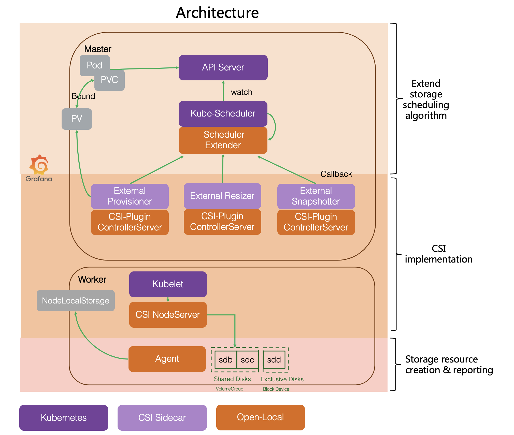

# Open-Local

English | [简体中文](./README_zh_CN.md)

`Open-Local` is a **local disk management system** composed of multiple components. With `Open-Local`, **using local storage in Kubernetes will be as simple as centralized storage**.

## Features

- Local storage pool management
- Dynamic volume provisioning
- Extended scheduler
- Volume expansion
- Volume snapshot
- Volume metrics
- Raw block volume

## Overall Architecture

`Open-Local`contains three types of components:

- Scheduler extender: as an extended component of Kubernetes Scheduler, adding local storage scheduling algorithm
- CSI plugins: providing the ability to create/delete volume, expand volume and take snapshots of the volume
- Agent: running on each node in the K8s cluster, and report local storage device information for Scheduler extender

## Who uses Open-Local

`Open-Local` has been widely used in production environments, and currently used products include:

- Alibaba Cloud ECP (Enterprise Container Platform)
- Alibaba Cloud ADP (Cloud-Native Application Delivery Platform)
- AntStack Plus Products

## User guide

More details [here](docs/user-guide/user-guide.md)

## Contact

Join us from DingTalk: Group No.34118035

## License

[Apache 2.0 License](LICENSE)