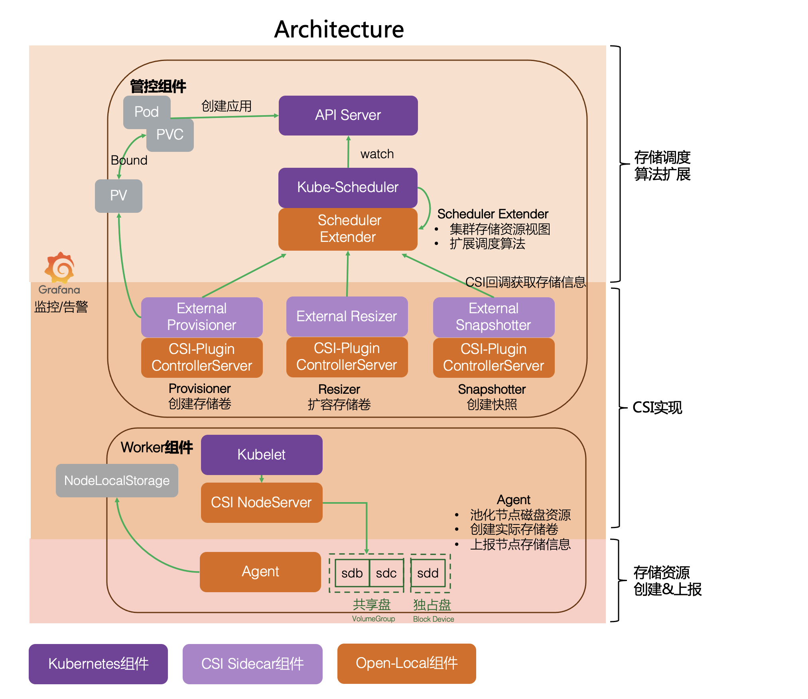

# Open-Local - 云原生本地磁盘管理系统

[English](./README.md) | 简体中文

`Open-Local`是由多个组件构成的**本地磁盘管理系统**，目标是解决当前 Kubernetes 本地存储能力缺失问题。通过`Open-Local`，**使用本地存储会像集中式存储一样简单**。

`Open-Local`已广泛用于生产环境，目前使用的产品包括：

- 阿里云 OECP (企业级容器平台)
- 阿里云 ADP (云原生应用交付平台)
- 蚂蚁 AntStack Plus 产品

## 特性

- 本地存储池管理
- 存储卷动态分配
- 存储调度算法扩展
- 存储卷扩容
- 存储卷快照
- 存储卷监控
- 原生块设备

## 架构



`Open-Local`包含三大类组件：

- Scheduler-Extender: 作为 Kubernetes Scheduler 的扩展组件，通过 Extender 方式实现，新增本地存储调度算法
- CSI: 按照 [CSI(Container Storage Interface)](https://kubernetes.io/blog/2019/01/15/container-storage-interface-ga/) 标准实现本地磁盘管理能力
- Agent: 运行在集群中的每个节点，通过上报集群中本地存储设备信息以供 Scheduler-Extender 决策调度

## 开发

详见[文档](docs/develop/develop_zh_CN.md)

```bash
mkdir -p $GOPATH/src/github.com/oecp/
cd $GOPATH/src/github.com/oecp/
git clone https://github.com/alibaba/open-local.git
# build binary
make
# build image
make image
```

## 许可证

[Apache 2.0 License](LICENSE)