# 调度算法

Open-Local 调度算法因存储类型不同而不同。对于 LVM 这种按需申请的存储类型，Open-Local 提供 Binpack（垂直）和 Spread（水平）两种调度算法；对于 Device 独占盘类型，Open-Local 提供一种最小满足需求容量策略的调度算法。

## LVM

Open-Local 托管用户指定的 VG，用户通过 NodeLocalStorageInitConfig 资源指定 VG 白名单。扩展调度插件中保存了各个节点所有 VG 的详细信息，这些信息作为数据用于调度算法。

LVM类型存储支持 指定VG名称 和 不指定VG名称两种：

1. 指定VG名称：由 Open-Local 决定从哪个节点上的指定 VG 来创建 LV
2. 不指定VG名称：由 Open-Local 决定从哪个节点上的哪个 VG 中来创建LV

LVM类型存储调度流程如下：

### Binpack算法

Binpack算法为默认算法，核心是优先从一个VG中创建LV，即优先将一个VG使用完。Binpack算法的优点是空闲存储空间充分利用、提高资源使用率。当用户申请一个LVM类型的PVC时，内部算法流程如下：

### Spread算法

Spread算法的核心是均匀地在各个VG中创建LV，使集群中的最大VG和最小VG的可用容量相差最小。Spread算法的好处是当一个VG故障不可用，只有最少量的容器受影响。

### 打分算法

$\sum_i^N score = \frac{allocated~size~of~VG_{i}}{total~size~of~VG_{i}}*MaxScore$

N：PVC总个数

allocated size of VG：本次调度算法一个VG被使用的总量

total size of VG：VG大小

MaxScore：const类型值，值为10（可变化）

## 独占盘类型

独占盘类型的存储盘与LVM类型的盘最大不同在于：LVM是可以从存储池中按量创建的，而独占盘则不一定是按量（比如当前有且只有一个1T的盘，若用户申请500G的，Open-Local会将当前最小满足申请量的盘，也就是这个1T的盘分配给用户）。

独占盘算法流程如下：

### 打分算法

$\sum_i^N score = \frac{request~size~of~PVC_{i}}{allocated~size~of~Disk_{i}}*MaxScore$

N：PVC总个数

request size of PVC：PVC请求的独占盘大小

allocated size of Disk：分配的独占盘大小

MaxScore：const类型值，值为10（可变化）