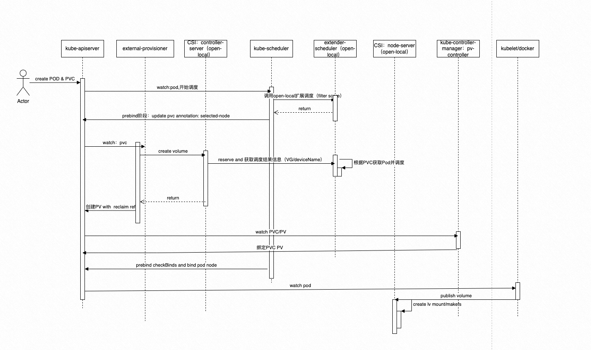
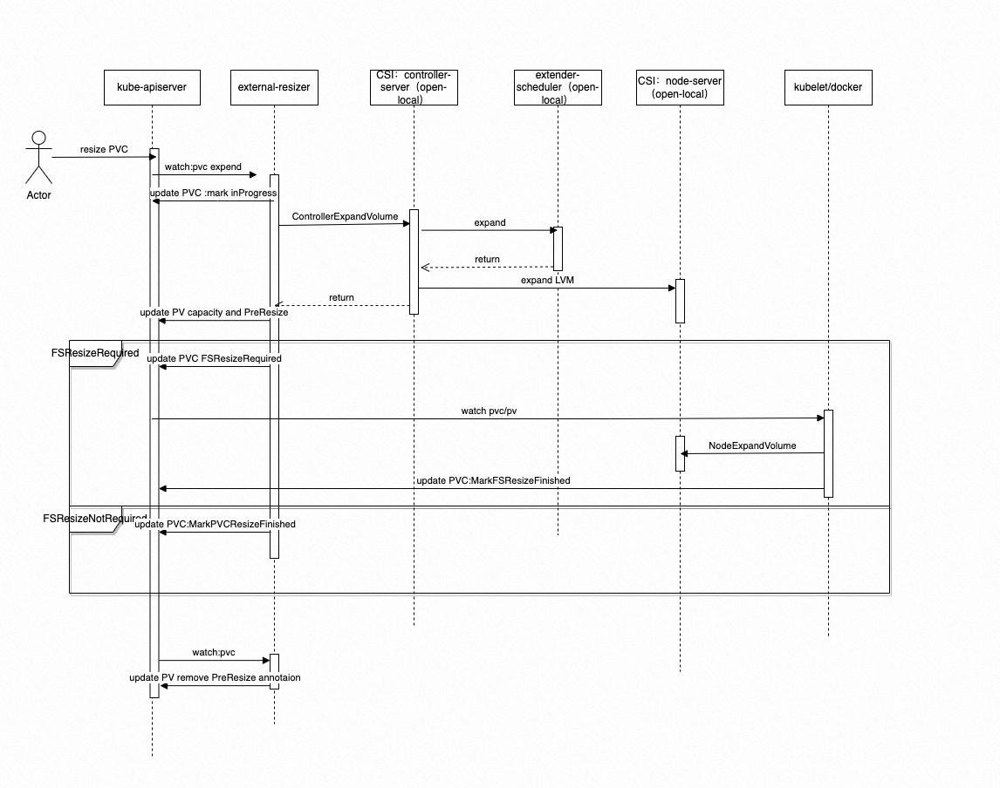
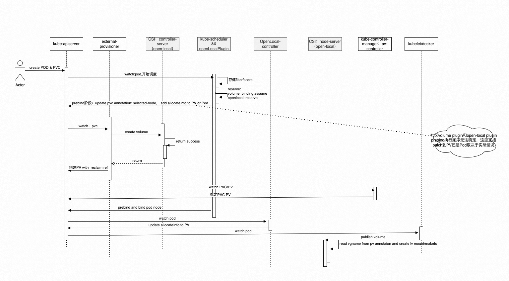
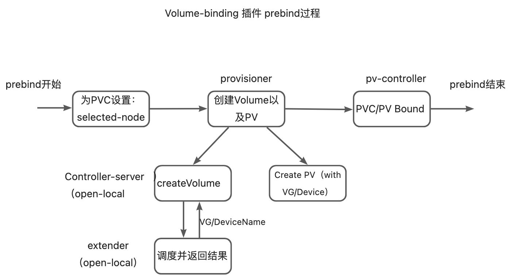
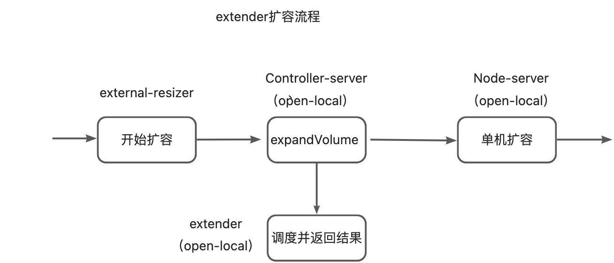
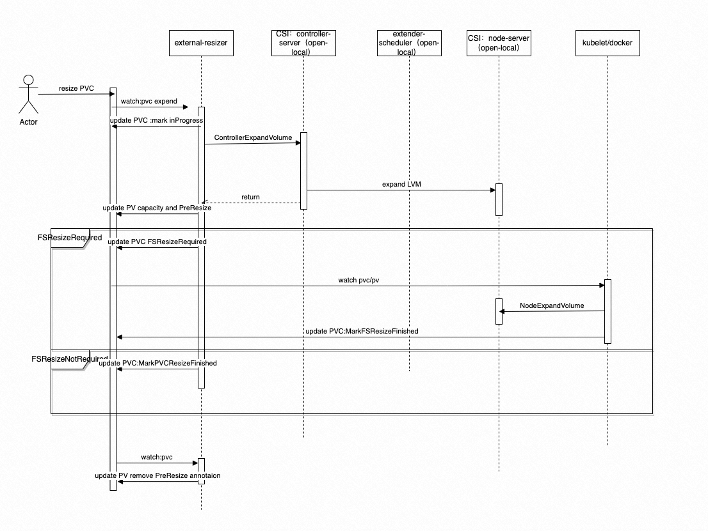

# framework 介绍

## Motivation

在专有云场景，大部分用户都未实现存储计算分离，依然大量使用本地盘。Open-local为本地盘使用提供了 LVM/Device 等类型的K8S调度方案，但目前仅支持了 extender方式的调度实现，在大规模场景，对调度的性能影响比较大，根据测试数据，会有几倍性能的下降。因此，在大规模用户场景，无法达到用户的调度性能要求，需要优化调度方案，且选项只有一个：改成framework方式，存储调度性能才能有质的提高。

## Proposal

### 整体设计要求

**功能一致性**

整体需要保持和原有extender调度功能的支持

**性能**

主要目标：主要是对于临时卷即InlineVolume类型的调度性能进行优化

对于PVC/PV存储调度：依然会存在较大瓶颈，且无法很好优化，原因在于社区存储插件VolumeBinding本身在prebind阶段就需要patch PVC，且需等待external-provisioner创建volume以及pv-controller进行bound操作完成等，过程漫长。

**兼容性**

需要考虑双调度器模式，如混部调度器和社区调度器并行运行，从而extender和framework并行运行的情况，主要验证项有账本一致性和流程功能一致性等。

**稳定性**

存储调度本身的逻辑比较复杂，因此需要保证足够的单测覆盖率，确保调度逻辑的正确性

**扩展性**

尽量能够实现将资源类型，打分策略等进行抽象，确保代码的可扩展性，可读性，新接入存储类型可以方便的实现。

#### extender调度过程



- extender和调度器交互：主要提供了filter和score实现
- 资源扣减：在external-provision调用open-local controller-server CreateVolume阶段进行

#### LVM PVC Expand流程


extender提供了expand的GRPC接口，会返回调度结果

### Open-local Framework调度插件设计

#### 总体扩展点


#### 调度流程



新增Pod和PV上的annotaion，用于存储PVC调度信息

```yaml
/*
        record: PVC->VG mapper
        - update by schedulerFramework prebind
        - read by schedulerFramework eventHandlers onPodAdd/Update
    */
    AnnotationPodPVCAllocatedNeedMigrateKey = "csi.aliyun.com/pod-pvc-migrate"

    /*
        record: vgName to PV
        - update by nsl controller
        - read by csi: nodeServer publishVolume
    */
    AnnotationPVAllocatedInfoKey = "csi.aliyun.com/pv-allocated"


type PVCAllocateInfo struct {
    PVCName         string `json:"pvcName"`
    PVCNameSpace    string `json:"pvcNameSpace"`
    PVAllocatedInfo `json:",inline"`
}

type PodPVCAllocateInfo struct {
    PvcAllocates map[string] /*PVCKey = PVCNameSpace/PVCName */ PVCAllocateInfo `json:"pvcAllocates"`
}

type PVAllocatedInfo struct {
    VGName     string `json:"vgName"`
    DeviceName string `json:"deviceName"`
    VolumeType string `json:"volumeType"`
}
```

流程拆分

```yaml
/**

支持的回收策略：delete/retain

case1：正常调度流程-动态绑定
    1. Create PVC 延迟binding（调度器watch到PVC创建，未bind node不处理）
    2. Create Pod，调度器开始调度Pod
    3. reserve阶段：调度PVC，更新cache，
    4. 开启volume_binding prebind 阶段，更新PVC（node-seleted）；开始openlocal prebind，更新PVC调度信息到PV或者Pod ## 注意，这里不清楚哪个prebind先执行
    5. external_provisional create Volume and PV(pending状态)
    6. 调度器Watch PV创建（pending状态），不处理
    7. pv_controller：bind PVC/PV
    8. 调度器watch到PV update：PV bound状态 此时PVC已经调度过，故向cache写入Volume信息，并删除pvc的调度信息，防止重复扣减
    9. openlocal-controller: watch到pod更新信息，如果发现有待迁移PVC分配信息，则将信息patch到对应PV上
    10. prebind结束，bind node


Case2：正常调度流程-静态绑定-（调度之前pv_controller提前已绑定）
    1. onPVAdd/onPVUpdate：1）未bound阶段非pending，创建了PV的调度信息 2）bound，则向cache写入Volume信息，并删除pvc的调度信息，防止重复扣减
    2. onPVCAdd/onPVCUpdate：1）未bound阶段，则不处理 2）bound阶段，则更新PVC info信息
    3.调度器：已bound的PVC跳过


case3：正常调度流程-静态绑定-调度器prebind阶段绑定
    1. onPVAdd/onPVUpdate：1）未bound阶段非pending，创建PV的调度信息 2）bound，则向cache写入Volume信息，并删除pvc的调度信息，防止重复扣减
    2. onPVCAdd/onPVCUpdate：1）未bound阶段，则不处理 2）bound阶段，bound阶段，则更新PVC info信息
    3. 调度器：正常reserve，后续PV收到消息，会自动revert PVC调度记录，并加上pv账本


case4:调度器重建流程以及各类异常调度流程
    onPVDelete： 删除PV allocated信息，删除账本信息
    onPVCDelete： 删除PVC allocated信息，info信息，如果PV还在，则继续保留PV部分，且不扣减账本
    case3.1 已Bound PVC/PV
            onPVAdd: 1)如果没有pv allocated信息，账本扣除并增加pv allocated信息 2)如果有pvc allocate信息，则要revert掉
            onPVUpdate： 同PVAdd
            OnPVCAdd：    1）发现PVC/PV bound，更新pvc info信息，如果有pvc allocateDetail，更新起request 2）校验pvDetail，符合resize逻辑，则做delta更新
            onPVCUpdate： 同PVCAdd
            调度流程：如果一个POD调度含已bound的PVC，则跳过该PVC调度

    case3.2 PV pending状态（上次调度prebind阶段调度器退出？）
            onPVAdd: 不处理，返回
            onPVUpdate： 不处理，返回
            OnPVCAdd：    没bound，则不处理（属于调度器处理流程）
            onPVCUpdate： 没bound，则不处理（属于调度器处理流程）

    case3.3 PV其他状态
            onPVAdd： 根据PV创建allocated信息，更新node账本（此时无PVC信息）
            onPVUpdate： 同add

    case3.4 pod prebind阶段异常或重启，并重调度Pod：
            1）如果prebind阶段，volume_binding prebind阶段部分PVC/PV已bound，该部分不会回滚，会按PVC/PV bound情况重新调度回该Node
            2）如果prebind阶段，volume_binding prebind阶段所有PVC/PV都未执行，则会回滚pvc调度信息


eventHandlers完整流程（PVC/PV）
    onPVCAdd/onPVCUpdate：在是local pvc情况下，记录或者更新pvc info request信息
        1.未bound，返回
        2. 和PV bound,获取spec里的request信息
            2.1. 如果pvc有明细信息，则更新明细request
            2.2. 如果没有pv明细，则返回
            2.3。如果有pv明细，则判断是否是pvc扩容，计算delta，如果是扩容，则更新扩容size

    onPVCDelete： 删除PVC info信息等

    onPVAdd/onPVUpdate：
        1. pending:不处理，返回
        2. 获取capacity，并判断是否已有allocated信息
            2.1. 没有allocated：如果之前内存没有allocated信息，则创建allocated，并更新账本
            2.2. revert PVC allocate信息，避免删除PVC重复扣
            2.3  已allocated：计算是否resize,更新allocated，更新账本
    onPVDelete： 删除（PVC/PV）allocated信息，删除账本信息

    onPodAdd/opPodUpdate:
        1. Pod是否调度
            1.1. pod已调度完成： 更新inlineVolume信息，更新账本
            1.2. Pod未调度：直接返回
    onPodDelete:
        删除inlineVolume信息，账本更新


*/
```

#### 方案设计关键点

##### 调度信息感知问题

**问题描述：**

社区已有Volume-binding的PV调度器插件，external-provisioner创建Volume（以及PV）的过程是在prebind阶段，即在prebind阶段会包含


这里可以看到，extender方案里提供了reserve的GRPC接口，会在prebind阶段将调度选择的VGName/DeviceName返回给provisioner并放到创建的PV里，这样单机的CSI插件才能感知到具体盘信息并创建实际存储单元。

问题：如果以framework方式，新增open-local plugin，则VG/DeviceName信息会在open-local plugin的reserve阶段确定，但此时由于open-local plugin无法再像extender提供RPC接口返回VG/Device调度信息，因此prebind阶段provision无法在创建PV的时候将信息补充到PV里。

**方案思路**：

对于framework方式，如何将调度信息更新到PV CR内？

option1：在open-local plugin prebind阶段，直接将调度信息更新到PV内？

这种方式是同步方式，最合理，但问题在于需要确保open-local plugin的prebind要在社区volume-binding插件之后，否则此时还没有PV

option2（不可行）：在open-local plugin prebind阶段，将调度信息更新到PVC内，再一步patch到PV上？

这种方式是异步方式，但和直接patch有同样的问题，社区volume-binding plugin本身会更新PVC，如果open-local plugin prebind发生在volume-binding之前并更新了PVC，会导致社区插件prebind失败

option3：在open-local plugin prebind阶段，将调度信息更新到Pod内，再一步patch到PV上

**综上: 兼容option1和option2逻辑，如果社区prebind先于openlocal，则优先更新PVC调度信息到PV，否则，更新到Pod再异步更新到PV的方式**

##### PVC扩容支持

这里同样extender提供了扩容接口，扩容流程中账本校验是同步的，可以根据调度器账本提前阻断资源不足导致扩容失败的问题。但framework方式无法实现同步检查，因此整体扩容流程需要重新设计。

**新的extender扩容流程设计：**

参照社区cpu和内存[in-place-update-pod-resources](https://github.com/kubernetes/enhancements/tree/master/keps/sig-node/1287-in-place-update-pod-resources)方案，有单机kubelet做资源校验并更新，而调度器只负责更新账本。同样，对于PVC扩容，我们也将流程改造成

1. controller-server不再检查更新调度账本（包括不回调extender 扩容接口），直接调用CSI node-server做lvm扩容操作，并返回lvm扩容结果
2. 单机端kubelet - - > CSI node-server执行文件系统扩容等，并根据扩容成功失败情况并更新 node扩容finshed或failed状态到PVC
3. open-local framework plugin 或 extender 的eventHandler watch PVC扩容信息更新账本


如上，和之前对比，去掉了扩容阶段对extender调度器的回调

##### 双调度器模式兼容

**双调度Cache维护**

统一eventHandler的PVC/PV 事件信息处理，其中framework插件设计了PVC/PV账本扣减明细信息，因此可以有效解决各类重复扣减等问题，但extender调度器之前则没有此方面设计，因此会出现cache更新不正确的问题。

解决方法：在extender cache内增加PVC/PV 明细信息，根据明细判断新增/扩容等情况

**CSI controller-server识别双调度器**
对于controller-server，按上面extender和framework流程，需要对不同的调度器做不同逻辑处理，因此需要感知PVC由哪个调度器调度

- extender调度器：则需要调用调度器调度接口进行调度并扣减资源，并返回VGName/DeviceName信息
- framework调度器：直接返回成功状态

由于controller-server接受的是PVC维度参数，因此需要增加infromer，建立PVC->Pod map，从而根据PVC获取Pod，进而获取调度器名称

### 方案和extender方式优劣对比
优势：

1. 更好的性能：extender方式，无论是否使用存储，都会经过extender，性能影响非常大
2. cache维护更为准确：extender缺少unreserve等逻辑，且在prebind期间做cache维护，缺少对失败的处理等

缺点：

1. 复杂性更高了，和社区存储插件配合，增加了各种异常情况的处理难度